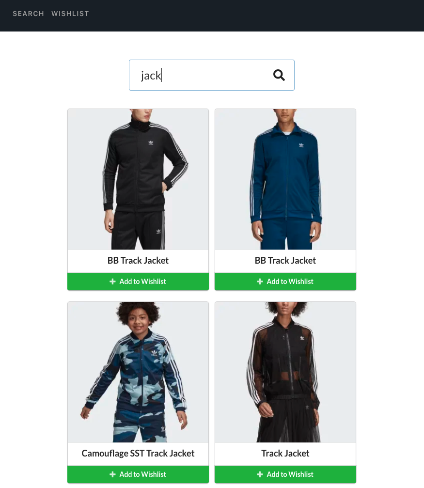

# Wishlist 

> A web app that allows search and add items to your wishlist

## Table of contents

- [General info](#general-info)
- [Screenshots](#screenshots)
- [Technologies](#technologies)
- [Setup](#setup)
- [Docker](#docker)
- [CI/CD](#CI/CD)
- [Deployment](#deployment)
- [Test](#test)

## General info

Add more general information about project. What the purpose of the project is? Motivation?

## Screenshots
- Homepage

- Wishlists Page

## Technologies

- React
- React Router
- Redux
- Jest
- Enzyme
- Semantic UI
- Docker
- TravisCI

## Setup

To get the frontend running locally:

- Clone this repo
- cd into the cloned repo
- `yarn` to install all required dependencies
- `yarn start` to start the local server

Local web server will use port 3000

## Docker

To setup locally:

- Download [Docker](https://docs.docker.com/) if you dont have it
- Make sure Docker is running
- Clone this repo
- cd into the project
- run `docker-compose up` in your terminal to setup, build and run image. Tjis may take some time to complete
- When complete go to your localhost on port 8080

## CI/CD

To setup for CI/CD for production Travis

- Make sure your project is on github
- Create a [Travis](https://travis-ci.org/) account if you dont have one and follow the instructions
- The Travis config is on the .travis.yml file
- Go to your account on Travis and start build
  https://docs.travis-ci.com/user/deployment/elasticbeanstalk/
  https://aws.amazon.com/

## Deployment

To setup deployment to AWS Elastic Bean Stalk:

- Create an [AWS](https://aws.amazon.com/) account if you dont have one and follow instruction to setup ELasticbeanstalk application
- See the section about [Travis-Elasticbeanstalk deployment](https://docs.travis-ci.com/user/deployment/elasticbeanstalk/) for more information.
- Copy the deployment config from the deployConfig file
- Add the copied contents to the .travis.yml file after the last command like this
  `before_deploy:
  - docker build -t prod .``deploy:
    skip_cleanup: true
    provider: elasticbeanstalk
    access_key_id: $ACCESS_KEY_ID
  secret_access_key:
    secure: $SECRET_ACCESS_KEY
    region: "us-east-2"
    app: "wishlist"
    env: "Wishlist-env"
    bucket_name: "elasticbeanstalk-us-east-2-275017868740" `
- Edit the details according to yours
-

## Test

In the project directory, you can run:

- `yarn test` to run tests
