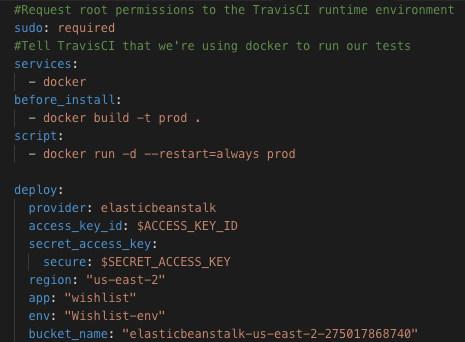

# Wishlist 

> A web app that allows search and add items to your wishlist

## Table of contents

- [Screenshots](#screenshots)
- [Technologies](#technologies)
- [Setup](#setup)
- [Docker](#docker)
- [CI/CD](#CI/CD)

## Screenshots

- Homepage

- Wishlists Page

## Technologies

- React
- React Router
- Redux
- Jest
- Enzyme
- Semantic UI
- Docker
- TravisCI

## Setup

To get the frontend running locally:

- Clone this repo
- cd into the cloned repo
- `yarn` to install all required dependencies
- `yarn start` to start the local server
- `yarn test` to run tests

Local web server will use port 3000

## Docker

To setup locally:

- Download [Docker](https://docs.docker.com/) if you dont have it
- Make sure Docker is running
- Clone this repo
- cd into the project
- run `docker-compose up` in your terminal to setup, build and run image. Tjis may take some time to complete
- When complete go to your localhost on port 8080

## CI/CD

To setup for CI/CD for production with Travis and AWS

- Create a [Travis](https://travis-ci.org/) account if you dont have one and follow the instructions
- Create an [AWS](https://aws.amazon.com/) account if you dont have one and follow instruction to setup ELasticbeanstalk application
- See the section about [Travis-Elasticbeanstalk deployment](https://docs.travis-ci.com/user/deployment/elasticbeanstalk/) for more information.
- Copy the deployment config from the deployConfig file
- Update the .travis.yml file by adding the deployment configuration found in the deployConfig file
- Edit the details accordingly
- Your .travis.yml file should now be similar to the image below:

- Make sure your project is on github
- Go to your Travis account and start build
- Travis automaticaly runs test whenever you make changes to the master
